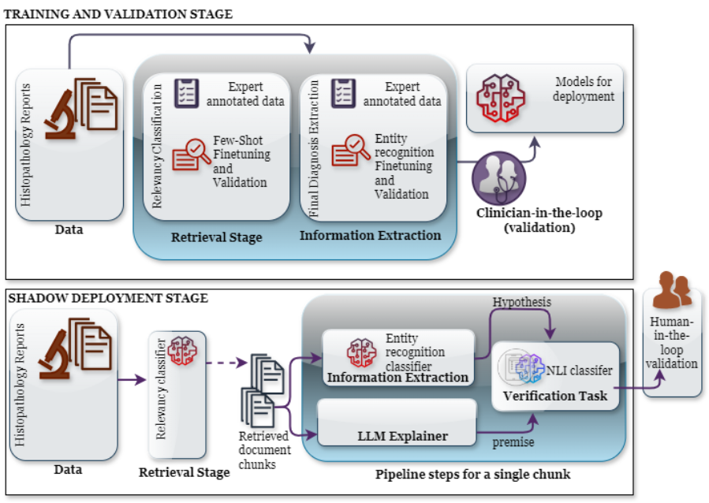

# Minimal Data Maximum Impact: Lessons Learned from Real-World Unstructured Data in Paediatric Care

**PLEASE NOTE:** This repository is not in active development and its requirements are not checked for vulnerabilities.  

## 🚀 Introduction

This package contains the source code for our end to end diagnosis identification pipeline. The below diagram encapsulates how various components of the pipeline interact with each other.



The pipeline processes the input text through 5 major components:

- **Relevancy Detection:** Understand if the text chunk is relevant or not
- **Entity Extraction:** Extract the specified NER entities from the relevant text
- **Positive/Negative Classification:** Assign Positive/Negative labels to entities for filtering
- **TinyLlama/Deepseek Prompt Generation:** Prompt a language model to identify an entity of interest from the given text chunk in a zero shot setting.
- **NLI:** Treat the LLM generated diagnosis as Premise and the final entity identified by the SetFit and GLiNER based pipeline components as Hypothesis and assign confidence scores for entailment, contradiction and neutral.

It takes as input a CSV containing `text` and an `entity_id` column as a unique identifier and stores the outputs of each model's predictions in separate columns namely:
- `relevance_prediction`, 
- `extracted_findings`, 
- `sentiment_prediction`, 
- `tinyllama_output`, 
- `tinyllama_nli_label`, 
- `tinyllama_nli_score`, 
- `deepseek_output`, 
- `deepseek_nli_label`, 
- `deepseek_nli_score`

The package is flexible enough to be run in local environments as well as containerized ones. In the containerized setting, the models and csv files are mounted as external volumes to minimize container size.

This package is currently designed to identify the main diagnosis from text chunks but can easily be modified to extract other kinds of entities. 

## ⚡ Usage

To use this package, you can simply add your trained model locations after following the training recipes outlined by [SetFit](https://arxiv.org/pdf/2209.11055) and [GLiNER](https://arxiv.org/pdf/2311.08526). The SetFit architecture was used for the relevancy classification and positive/negative identification tasks whereas GLiNER was used specifically for the entity extraction task.

The package involves testing two LLMs namely **TinyLlama-1.1B-Chat-v1.0** and **DeepSeek-R1-Distill-Qwen-1.5B**. The DeepSeek-R1-Distill-Qwen-1.5B integration is for further testing as the model exhibits strong reasoning capabilites in part by generating reasoning tokens before its final output. Both LLMs are used as zero-shot verifiers in the pipeline. The models identify the final diagnosis from the original text and output the result in a separate column, namely `tinyllama_output` and `deepseek_output`. The input prompt to the LLM can be modified in the code itself in the `TinyLlamaInference` and `DeepSeekInference` classes respectively. 

An NLI step is then performed between the final diagnosis identified by the GLiNER and Setfit pipeline and the output generated by the LLMs where the final diagnosis is treated as the premise and the LLM output as the hypothesis.


### Finetuning Workflow


For fine-tuning SetFit based pipeline components, please refer to [Setfit's documentation on Huggingface](https://huggingface.co/docs/setfit/how_to/classification_heads) and for fine-tuning GLiNER based pipeline components for your own use case, please refer to [GLiNER's fine-tuning notebook](https://github.com/urchade/GLiNER/blob/main/examples/finetune.ipynb).


The base models used for Setfit and GLiNER fine-tuning were:

- Sentence Transformer for SetFit: [BioBERT-mnli-snli-scinli-scitail-mednli-stsb](https://huggingface.co/pritamdeka/BioBERT-mnli-snli-scinli-scitail-mednli-stsb)
- Base Tokenizer for GLiNER: [deberta-v3-large](https://huggingface.co/microsoft/deberta-v3-large)

Please note that the Relevance model expects to be trained with labels: "TRUE/FALSE" and the Sentiment model expects to be trained with labels: "Positive/Negative".

If you need to change the entities to be extracted by the entity extraction model depending on your own fine-tuning use case, please change the below lines in the NERExtractor class in ner_extractor.py:

```python
self.context = "Please find the diagnoses from the given text string."
self.labels = ["Diagnosis"] # Change these to your own labels
```

### Inference Workflow

As mentioned earlier, model inference consists of a series of steps to extract and verify the entities. 

The main entry point requires the following arguments to be passed before execution:

--input_csv: "Path to input CSV containing columns `text` and `entity_id`"
--output_csv: "Path to output CSV which will add all columns from various components in the pipeline after processing"
--relevance_model_dir: "Path to trained Relevance model folder"
--ner_model_dir: "Path to trained Entity Extraction model folder"
--sentiment_model_dir: "Path to trained Sentiment model folder"
--tinyllama_model_dir: "Path to TinyLlama model folder"
--nli_model_dir: "Path to NLI model folder"
--deepseek_model_dir: "Path to DeepSeek model folder"


The specific language models that were used in our pipeline are:

- [TinyLlama-1.1B-Chat-v1.0](https://huggingface.co/TinyLlama/TinyLlama-1.1B-Chat-v1.0)
- [DeepSeek-R1-Distill-Qwen-1.5B](https://huggingface.co/deepseek-ai/DeepSeek-R1-Distill-Qwen-1.5B)

The NLI model used is:

- [deberta-base-long-nli](https://huggingface.co/tasksource/deberta-base-long-nli)

`pipeline.py` orchestrates the workflow for the entire project. The workflow consists of the following components:

    1. Load data.
    2. Predict relevancy.
    3. Run NER for relevant rows.
    4. Explode findings.
    5. Run sentiment classification on each finding.
    6. Aggregate final diagnosis.
    7. Generate text with TinyLlama & run NLI.
    8. Generate text with DeepSeek & run NLI.
    9. Save results to CSV.

## 📚 Installations

### Run without podman/docker

To install and run it locally on your laptop without a docker/podman container,

1. Clone the repository

2. Setup a virtual environment with python=">=3.10,<3.11" and with packages present in requirements.txt installed.

3. Run the package by passing in the specified arguments:

```bash
python -m <parent_folder>.main --input_csv "path_to_input_csv" --output_csv "path_to_output_csv" --relevance_model_dir "path_to_relevance_model" --ner_model_dir "path_to_ner_model" --sentiment_model_dir "path_to_sentiment_model" --tinyllama_model_dir "path_to_tinyllama_model" --nli_model_dir "path_to_nli_model" --deepseek_model_dir "path_to_deepseek_model"
```


### Run with podman/docker by mounting external volumes


1. Build image

```bash
podman build -t <parent_folder_name> .
```

2. Run the container

```bash
podman run --rm \
-v <EXTERNAL_DIRECTORY_FOR_TRAINED_RELEVANCE_MODEL>:/app/models/relevance:ro \
-v <EXTERNAL_DIRECTORY_FOR_TRAINED_NER_MODEL>:/app/models/ner:ro \
-v <EXTERNAL_DIRECTORY_FOR_TRAINED_SENTIMENT_MODEL>:/app/models/sentiment:ro \
-v <EXTERNAL_DIRECTORY_FOR_TOKENIZER>:/app/tokenizer:ro \
-v <EXTERNAL_DIRECTORY_FOR_SENTENCE_TRANSFORMER:/app/sentence_transformer:ro \
-v <EXTERNAL_DIRECTORY_FOR_NLI_MODEL>:/app/models/nli_model:ro \
-v <EXTERNAL_DIRECTORY_FOR_TINYLLAMA_MODEL>:/app/models/tinyllama:ro \
-v <EXTERNAL_DIRECTORY_FOR_DEEPSEEK_MODEL>:/app/models/deepseek:ro \
-v <EXTERNAL_PATH_TO_INPUT_CSV>:/app/<INPUT_CSV_NAME>:ro \
-v <EXTERNAL_PATH_TO_OUTPUT_CSV:/app/<OUTPUT_CSV_NAME> \
<IMAGE_NAME> \
--input_csv /app/<INPUT_CSV_NAME> \
--output_csv /app/<OUTPUT_CSV_NAME> \
--relevance_model_dir /app/models/relevance \
--ner_model_dir /app/models/ner \
--sentiment_model_dir /app/models/sentiment \
--tinyllama_model_dir /app/models/tinyllama \
--nli_model_dir /app/models/nli_model \
--deepseek_model_dir /app/models/deepseek
```

##  🤝 Acknowledgements
* DRE team
* Pavithra Rajendran (Code Reviewer)
* Sebin Sabu (Code Reviewer)
* Alexandros Zenonos (Code Reviewer)

##  🤝 Contributors
* Jaskaran Singh Kawatra - Machine Learning Engineer @ GOSH DRIVE (Core Contributor)
* Dr. Pavithra Rajendran - NLP & Computer Vision Lead @ GOSH DRIVE
* Sebin Sabu - Data Scientist @ GOSH DRIVE
* Caroline Baumgartner - Data Scientist @ GOSH DRIVE
* Avish Vijayaraghavan - PhD student @ Imperial College London
* Ewart Jonathan Sheldon - Software Engineer (Research) @ GOSH DRIVE
* Dr. Neil J. Sebire - Clinical Lead @ GOSH DRIVE

For any queries, please contact us via email @ jaskaran.kawatra@gosh.nhs.uk

## Citing & Authors

If you find this repository helpful, feel free to cite our publication:

### Primary Citation

```bash
@article{
    title = "Minimal Data Maximum Impact: Lessons Learned from Real-World Unstructured Data in Paediatric Care",
    author = "Kawatra, Jaskaran Singh and Sabu, Sebin and Rajendran, Pavithra and Baumgartner, Caroline and Vijayaraghavan, Avish and Sheldon, Ewart Jonathan and Booth, John and Sebire, Neil and Patel, Shiren and Zenonos, Alexandros and Pope, Rebecca"
    booktitle = "to be updated",
    month = "to be updated",
    year = "to be updated",
    publisher = "to be updated",
    url = "to be updated",
}
```

### Related Work

This implementation builds upon the following works:

1. **Efficient Few-Shot Learning Without Prompts**

```bash
@misc{https://doi.org/10.48550/arxiv.2209.11055,
  doi = {10.48550/ARXIV.2209.11055},
  url = {https://arxiv.org/abs/2209.11055},
  author = {Tunstall, Lewis and Reimers, Nils and Jo, Unso Eun Seo and Bates, Luke and Korat, Daniel and Wasserblat, Moshe and Pereg, Oren},
  keywords = {Computation and Language (cs.CL), FOS: Computer and information sciences, FOS: Computer and information sciences},
  title = {Efficient Few-Shot Learning Without Prompts},
  publisher = {arXiv},
  year = {2022},
  copyright = {Creative Commons Attribution 4.0 International}
}
```

2. **GLiNER: Generalist Model for Named Entity Recognition using Bidirectional Transformer**

```bash
@inproceedings{zaratiana-etal-2024-gliner,
    title = "{GL}i{NER}: Generalist Model for Named Entity Recognition using Bidirectional Transformer",
    author = "Zaratiana, Urchade  and
      Tomeh, Nadi  and
      Holat, Pierre  and
      Charnois, Thierry",
    editor = "Duh, Kevin  and
      Gomez, Helena  and
      Bethard, Steven",
    booktitle = "Proceedings of the 2024 Conference of the North American Chapter of the Association for Computational Linguistics: Human Language Technologies (Volume 1: Long Papers)",
    month = jun,
    year = "2024",
    address = "Mexico City, Mexico",
    publisher = "Association for Computational Linguistics",
    url = "https://aclanthology.org/2024.naacl-long.300",
    doi = "10.18653/v1/2024.naacl-long.300",
    pages = "5364--5376",
    abstract = "Named Entity Recognition (NER) is essential in various Natural Language Processing (NLP) applications. Traditional NER models are effective but limited to a set of predefined entity types. In contrast, Large Language Models (LLMs) can extract arbitrary entities through natural language instructions, offering greater flexibility. However, their size and cost, particularly for those accessed via APIs like ChatGPT, make them impractical in resource-limited scenarios. In this paper, we introduce a compact NER model trained to identify any type of entity. Leveraging a bidirectional transformer encoder, our model, GLiNER, facilitates parallel entity extraction, an advantage over the slow sequential token generation of LLMs. Through comprehensive testing, GLiNER demonstrate strong performance, outperforming both ChatGPT and fine-tuned LLMs in zero-shot evaluations on various NER benchmarks.",
}
```
3. **Evidence Extraction to Validate Medical Claims in Fake News Detection**

```bash
@inproceedings{deka2022evidence,
  title={Evidence Extraction to Validate Medical Claims in Fake News Detection},
  author={Deka, Pritam and Jurek-Loughrey, Anna and others},
  booktitle={International Conference on Health Information Science},
  pages={3--15},
  year={2022},
  organization={Springer}
}
```

4. **DEBERTA: Decoding-Enhanced BERT with Disentangled Attention**

```bash
@inproceedings{
he2021deberta,
title={DEBERTA: DECODING-ENHANCED BERT WITH DISENTANGLED ATTENTION},
author={Pengcheng He and Xiaodong Liu and Jianfeng Gao and Weizhu Chen},
booktitle={International Conference on Learning Representations},
year={2021},
url={https://openreview.net/forum?id=XPZIaotutsD}
}
```

5. **TinyLlama: An Open-Source Small Language Model**

```bash
@misc{zhang2024tinyllama,
      title={TinyLlama: An Open-Source Small Language Model}, 
      author={Peiyuan Zhang and Guangtao Zeng and Tianduo Wang and Wei Lu},
      year={2024},
      eprint={2401.02385},
      archivePrefix={arXiv},
      primaryClass={cs.CL}
}
```

6. **DeepSeek-R1: Incentivizing Reasoning Capability in LLMs via Reinforcement Learning**

```bash
@misc{deepseekai2025deepseekr1incentivizingreasoningcapability,
      title={DeepSeek-R1: Incentivizing Reasoning Capability in LLMs via Reinforcement Learning}, 
      author={DeepSeek-AI and Daya Guo and Dejian Yang and Haowei Zhang and Junxiao Song and Ruoyu Zhang and Runxin Xu and Qihao Zhu and Shirong Ma and Peiyi Wang and Xiao Bi and Xiaokang Zhang and Xingkai Yu and Yu Wu and Z. F. Wu and Zhibin Gou and Zhihong Shao and Zhuoshu Li and Ziyi Gao and Aixin Liu and Bing Xue and Bingxuan Wang and Bochao Wu and Bei Feng and Chengda Lu and Chenggang Zhao and Chengqi Deng and Chenyu Zhang and Chong Ruan and Damai Dai and Deli Chen and Dongjie Ji and Erhang Li and Fangyun Lin and Fucong Dai and Fuli Luo and Guangbo Hao and Guanting Chen and Guowei Li and H. Zhang and Han Bao and Hanwei Xu and Haocheng Wang and Honghui Ding and Huajian Xin and Huazuo Gao and Hui Qu and Hui Li and Jianzhong Guo and Jiashi Li and Jiawei Wang and Jingchang Chen and Jingyang Yuan and Junjie Qiu and Junlong Li and J. L. Cai and Jiaqi Ni and Jian Liang and Jin Chen and Kai Dong and Kai Hu and Kaige Gao and Kang Guan and Kexin Huang and Kuai Yu and Lean Wang and Lecong Zhang and Liang Zhao and Litong Wang and Liyue Zhang and Lei Xu and Leyi Xia and Mingchuan Zhang and Minghua Zhang and Minghui Tang and Meng Li and Miaojun Wang and Mingming Li and Ning Tian and Panpan Huang and Peng Zhang and Qiancheng Wang and Qinyu Chen and Qiushi Du and Ruiqi Ge and Ruisong Zhang and Ruizhe Pan and Runji Wang and R. J. Chen and R. L. Jin and Ruyi Chen and Shanghao Lu and Shangyan Zhou and Shanhuang Chen and Shengfeng Ye and Shiyu Wang and Shuiping Yu and Shunfeng Zhou and Shuting Pan and S. S. Li and Shuang Zhou and Shaoqing Wu and Shengfeng Ye and Tao Yun and Tian Pei and Tianyu Sun and T. Wang and Wangding Zeng and Wanjia Zhao and Wen Liu and Wenfeng Liang and Wenjun Gao and Wenqin Yu and Wentao Zhang and W. L. Xiao and Wei An and Xiaodong Liu and Xiaohan Wang and Xiaokang Chen and Xiaotao Nie and Xin Cheng and Xin Liu and Xin Xie and Xingchao Liu and Xinyu Yang and Xinyuan Li and Xuecheng Su and Xuheng Lin and X. Q. Li and Xiangyue Jin and Xiaojin Shen and Xiaosha Chen and Xiaowen Sun and Xiaoxiang Wang and Xinnan Song and Xinyi Zhou and Xianzu Wang and Xinxia Shan and Y. K. Li and Y. Q. Wang and Y. X. Wei and Yang Zhang and Yanhong Xu and Yao Li and Yao Zhao and Yaofeng Sun and Yaohui Wang and Yi Yu and Yichao Zhang and Yifan Shi and Yiliang Xiong and Ying He and Yishi Piao and Yisong Wang and Yixuan Tan and Yiyang Ma and Yiyuan Liu and Yongqiang Guo and Yuan Ou and Yuduan Wang and Yue Gong and Yuheng Zou and Yujia He and Yunfan Xiong and Yuxiang Luo and Yuxiang You and Yuxuan Liu and Yuyang Zhou and Y. X. Zhu and Yanhong Xu and Yanping Huang and Yaohui Li and Yi Zheng and Yuchen Zhu and Yunxian Ma and Ying Tang and Yukun Zha and Yuting Yan and Z. Z. Ren and Zehui Ren and Zhangli Sha and Zhe Fu and Zhean Xu and Zhenda Xie and Zhengyan Zhang and Zhewen Hao and Zhicheng Ma and Zhigang Yan and Zhiyu Wu and Zihui Gu and Zijia Zhu and Zijun Liu and Zilin Li and Ziwei Xie and Ziyang Song and Zizheng Pan and Zhen Huang and Zhipeng Xu and Zhongyu Zhang and Zhen Zhang},
      year={2025},
      eprint={2501.12948},
      archivePrefix={arXiv},
      primaryClass={cs.CL},
      url={https://arxiv.org/abs/2501.12948}, 
}
```

### 📃 Licenses

Code in this repository is covered by the MIT License and for all documentation the [Open Government License (OGL)](https://www.nationalarchives.gov.uk/doc/open-government-licence/version/3/) is used.

Copyright (c) 2024 Crown Copyright
